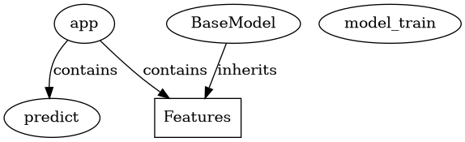

# mlflow_trial Documentation

## Overview

A brief description of your project. first_project/ ├── README.md

## Project Structure

- **tmpf0ckpyig/**
  - .gitignore
  - Dockerfile
  - README.md
  - app.py
  - docker-compose.yml
  - **mlflow_server/**
    - Dockerfile
  - **mlruns/**
    - **1/**
      - **7021a11e408e463bb5ebd96bc6e03ee0/**
        - **artifacts/**
          - **model/**
            - MLmodel
            - conda.yaml
            - **metadata/**
              - MLmodel
              - conda.yaml
              - python_env.yaml
              - requirements.txt
            - model.pkl
            - python_env.yaml
            - registered_model_meta
            - requirements.txt
  - model_train.py
  - requirements.txt

## API Reference

### Classes

- **Features**
### Functions

- **predict**
## Code Relationships

